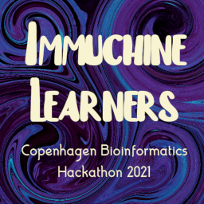
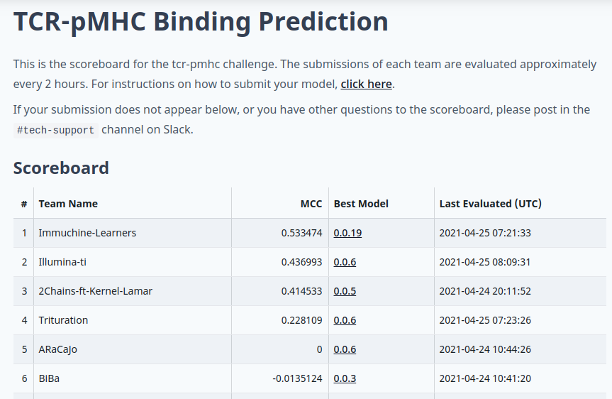
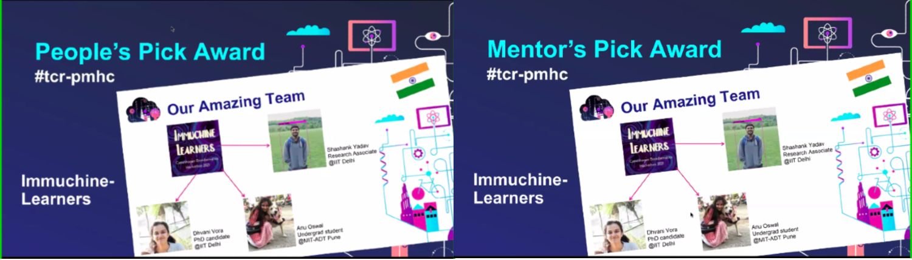

# T-cell binding prediction challenge (TCR-pMHC)

## Challenge Aim

This challenge focuses on the binding between a T cell and its targets. The ability to predict this accurately has important applications in vaccine development and cancer immunotherapy. Using a dataset consisting of sequences of T-cell receptors and peptide-MHCs, together with the interaction energy predicted from structural models, participants will develop machine learning algorithms to predict the binding between a T cell and potential targets.


## Team: Immuchine Learners



## We won the T-cell binding prediction challenge (TCR-pMHC) by utilizing a hybrid CNN-LSTM model. 



## We won the Mentor's Pick Award alongwith the People's Pick Award


### Please see the hackathon2021.ipynb for the code we developed.

### Original instruction for this repository are Given Below


At prediction time, you are given a zip file using the `--input-zip` argument. 
For each `*.npz` file, output your prediction. 

## Data and example model
The training dataset can be found in the data/training_set.zip file, and should be extracted to the data/train folder.
An example CNN model is available as a notebook and in src directory.

### Example Output
You code should output a file called `predictions.csv` in the following format:

```
index,prediction
0,1
1,0
2,0
```

## Benchmarking System
The continuous integration script in `.github/workflows/ci.yml` will automatically build the `Dockerfile` on every commit to the `main` branch. This docker image will be published as your hackathon submission to `https://biolib.com/<YourTeam>/<TeamName>`. For this to work, make sure you set the `BIOLIB_TOKEN` and `BIOLIB_PROJECT_URI` accordingly as repository secrets. 

To read more about the benchmarking system [click here](https://www.notion.so/Benchmarking-System-46bfaeea0119490cb611688b493c589a).
