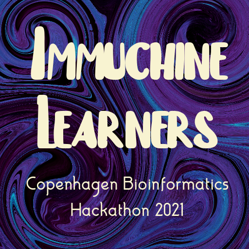

# Immuchine Learners

Our team is from the Indian Institute of Technology, Delhi, and MIT-ADT School of Bioengineering Sciences and Research, Pune. We think proteins are cool, and so are scientists. We are a bunch of modern-day Sherlock Holmes' always on the lookout for new mysteries.

### Project Description
We are working on the `tcr-pmhc` challenge.
To predict using our model, press "Open Application" on the left. 

### Team Members
Shashank Yadav (IIT Delhi, India)
Dhvani Vora (IIT Delhi, India)
Anu Oswal (MIT-ADT Pune, India)

### Scoreboard
You can track the performance of our predictor in the [challenge scoreboard](https://biolib.com/biohackathon/tcr-pmhc-scoreboard/).
